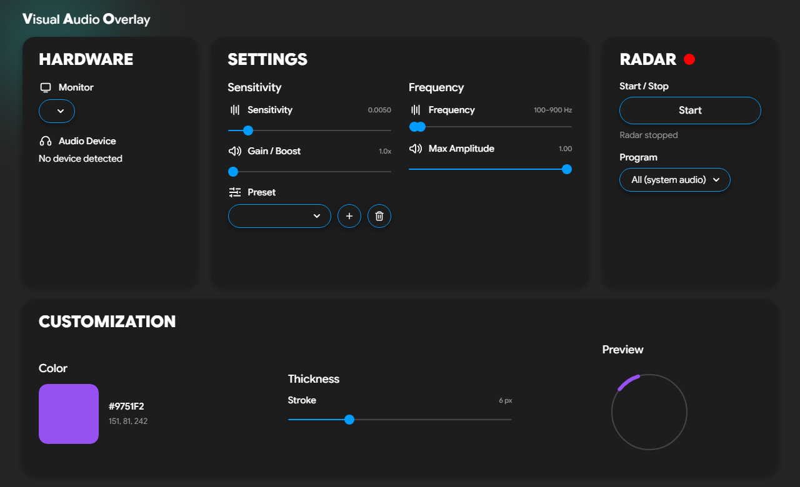

<h1 align="center">Visual Audio Overlay</h1>

<p align="center">
  <b>See what you can't hear.</b><br>
  An accessibility overlay that turns in-game sound into a real-time visual radar,
  built for gamers with single-sided deafness (SSD) or hearing loss.
</p>

<p align="center">
  
  
  
  
</p>

<p align="center">
  
</p>

---

## What it is

Visual Audio Overlay listens to your PC's audio and draws a sleek, transparent,
Fortnite-style circular radar on top of your game. When a sound happens, an arc
lights up in the direction it came from, so you can *see* footsteps, gunshots,
reloads, and ability cues the instant they play.

It runs as a two-part app: a control panel you keep on a second monitor, and the
radar overlay that floats over your game on your main screen.

## Who it's for

- Players with **single-sided deafness** or **hearing loss** who lose directional audio.
- Anyone gaming with one earbud in, or in a quiet household, who still wants positional awareness.
- Competitive players who want footsteps and other key cues filtered out from background noise.

## Features

- **Directional radar overlay.** Transparent, always-on-top, click-through. Arcs
  fade in and out in the direction of each sound.
- **Per-application capture.** Pick a single program (your game) so other apps
  like Discord voice chat are ignored. Uses the Windows WASAPI process-loopback
  API; pick **All (system audio)** to capture everything as before.
- **Game-specific presets.** Built-in frequency band-pass filters (CS2, Valorant,
  Fortnite, and more) isolate footsteps and ignore useless low-end rumble.
- **Smart audio boost.** Amplifies quiet, distant sounds so faint cues still register.
- **Stereo and surround.** 7.1 / multi-channel headsets unlock 360 degree front/back
  detection; stereo headsets run in left/right mode automatically.
- **Saveable presets.** Store per-game sensitivities and filter setups and switch in one click.
- **Full customization.** Pick the radar's accent color and line thickness, with a
  live preview that matches exactly what shows up in game.
- **Non-intrusive by design.** It does not inject into game memory or modify any game
  files. It simply reads the standard Windows audio output (WASAPI loopback).

## How it works

The app captures your system's audio output (the same signal going to your
headphones) and analyzes the balance between channels to estimate the direction
of each sound. That direction is drawn as an arc on the radar. Because it only
reads audio you are already playing, there is no interaction with the game itself.

> **Note on detection range:** front/back separation depends on your headset. A
> true 7.1 / 8-channel device enables full 360 degree detection. A stereo device
> can only resolve left vs. right.

## Getting started (from source)

```bash
git clone https://github.com/mike-s-zaugg/VisualAudioOverlay.git
cd VisualAudioOverlay
pip install -r requirements.txt
python main.py
```

Requires **Windows 10 (build 19041+)** and **Python 3.10+**.

### Quick start

1. Launch the app and pick your **Monitor** (where the radar appears).
2. Choose a **Preset** that matches your game, or tune Sensitivity, Gain, and the
   Frequency range yourself.
3. Set your radar **Color** and **Thickness** in Customization.
4. (Optional) In the Radar panel, pick a **Program** to capture only that game's
   audio. Leave it on **All (system audio)** to capture everything. The program
   must already be playing sound to appear in the list.
5. Hit **Start** in the Radar panel. The overlay appears on your selected monitor.

## Build a standalone .exe

```bash
pip install pyinstaller
pyinstaller AudioRadar.spec
```

The build bundles the full UI, icons, and font, so the executable runs offline
with no extra setup. Output lands in `dist/`.

> If a one-file build shows a blank window (a known QtWebEngine quirk), use a
> one-directory build instead.

## Roadmap

- **Editable presets** saved to disk.
- **Haptic output.** Drive ButtKicker-style shakers from the strongest audio cue.

## Project layout

| File | Role |
|------|------|
| `main.py` | App entry. Hosts the control panel and overlay, exposes the JS/Python bridge. |
| `audio_capture.py` | Captures loopback audio, band-pass filters it, computes direction + intensity. |
| `process_loopback.py` | Per-application capture via the WASAPI process-loopback API, plus enumeration of programs with audio. |
| `overlay.py` | The transparent, click-through radar window. |
| `dashboard_v2/` | The control-panel UI (HTML/CSS/JS, icons, bundled font). |

## Support

Visual Audio Overlay is free. If it helps you, you can support development here:

**[Buy Me a Coffee](https://buymeacoffee.com/mikezaugg)**

## Disclaimer

This tool reads only standard Windows audio output and does not read or modify
game memory or files. It is intended as an accessibility aid. Anti-cheat policies
vary between games, so use it at your own discretion.

## AI Usage

I want to publicly tell how I used AI in this code. The UI was 100% made by myself.
I have used Claude Code for some logic and to help me with decisions. Most of my code is pushed through it.

## Contributing

Contributions are welcome. Bug reports, fixes, and new features all help. Please
read [CONTRIBUTING.md](CONTRIBUTING.md) before opening a pull request, and see
[SECURITY.md](SECURITY.md) for how to report vulnerabilities.

Good first issues to pick up: mono audio output for single-sided listeners and a
Linux port.

## License

Copyright (c) 2026 Mike Zaugg.

This project is **source-available**, not open source. It is licensed under the
**Functional Source License, Version 1.1, MIT Future License (FSL-1.1-MIT)**. In
short: you are free to use, modify, and contribute to the code for any purpose
except building a competing product. Each release automatically becomes available
under the permissive MIT license two years after it ships.

See the [LICENSE](LICENSE) for the full terms.
